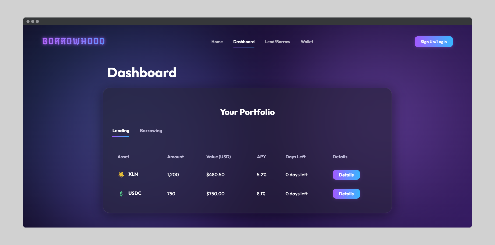

# 🌟 Borrowhood


**Borrowhood** is a modern, decentralized lending platform built on the Stellar blockchain. It enables users to lend and borrow cryptocurrency assets seamlessly through an intuitive interface with no traditional banking requirements.

## ✨ Features

### 🔐 Secure Authentication

- **Passkey Authentication**: Passwordless login using modern passkey technology
- **No Seed Phrases**: Forget complicated seed phrases or private keys
- **Phishing Resistant**: Enhanced security against common attacks

### 💰 Lending & Borrowing

- **Earn Interest**: Competitive APY rates on deposited assets
- **Flexible Loan Terms**: Choose from 1 month, 3 months, or custom durations
- **Real-time Interest Calculation**: See your earnings before you commit
- **Multiple Assets**: Support for XLM, USDC and more (expandable)

### 👛 Wallet Management

- **Asset Dashboard**: View all your holdings in one place
- **Transaction History**: Track your lending, borrowing, and transfer activities
- **Send Tokens**: Easily transfer assets to other users
- **Real-time Balances**: Always up-to-date asset information

### 📊 Portfolio Dashboard

- **Performance Tracking**: Monitor your lending and borrowing positions
- **Interest Accrual**: Watch your earnings grow in real-time
- **Detailed Analytics**: Understand your crypto portfolio better

## 📸 Screenshots

### Home Page


### Why Borrowhood


### How Borrowhood Works


### Dashboard



### Lending Interface


### Borrowing Interface


### Wallet Management


## 🎬 Video Demos

Watch our demo videos to see Borrowhood in action:

- [Borrowhood - How to Lend & Borrow Crypto!](https://youtu.be/pxDQ5Xha0vA) - Learn how to use Borrowhood to lend and borrow cryptocurrency assets on the Stellar blockchain.

## 🚀 Getting Started

### Prerequisites

- Node.js (v16+)
- npm or yarn

### Installation

1. **Clone the repository**

   ```bash
   git clone https://github.com/yourusername/borrowhood.git
   cd borrowhood
   ```

2. **Install dependencies**

   ```bash
   npm install
   # or with yarn
   yarn install
   ```

3. **Set up environment variables**
   Create a `.env` file in the root directory and add:

   ```
   VITE_rpcUrl=https://your-stellar-rpc-url
   VITE_networkPassphrase=your-network-passphrase
   VITE_walletWasmHash=your-wallet-wasm-hash
   VITE_launchtubeUrl=your-launchtube-url
   VITE_launchtubeJwt=your-launchtube-jwt
   VITE_mercuryProjectName=your-mercury-project-name
   VITE_mercuryUrl=your-mercury-url
   VITE_mercuryJwt=your-mercury-jwt
   VITE_nativeContractId=your-native-contract-id
   ```

4. **Run the development server**

   ```bash
   npm run dev
   # or with yarn
   yarn dev
   ```

5. **Open your browser**
   Navigate to `http://localhost:5173` to see the application.

### Building for Production

To create a production build:

```bash
npm run build
# or with yarn
yarn build
```

## 👥 Team

Meet the team behind **Borrowhood**:

- **Shahrzad Masoumnia (Product Manager & UX)**  
  [GitHub](https://github.com/shahrzadmn) | [LinkedIn](https://www.linkedin.com/in/shahrzadmasoumnia/)

- **Venkateshwar Yadav (Frontend & Passkey Integration)**  
  [GitHub](https://github.com/mccharliesins) | [LinkedIn](https://www.linkedin.com/in/mccharliesins/)

- **Prisha Thakkar (Presentation Manager)**  
  [GitHub](https://github.com/PrishaTh) | [LinkedIn](https://www.linkedin.com/in/prisha-thakkar-913643302/)

- **Robin Gershman (Smart Contracts)**  
  [GitHub]() | [LinkedIn](https://www.linkedin.com/in/gershmanrobin/)

## 💻 Tech Stack

- **Frontend**: Svelte 5
- **Language**: TypeScript
- **Build Tool**: Vite
- **Blockchain**: Stellar Network
- **Authentication**: Passkey-kit for passwordless auth
- **Styling**: CSS with animation effects

## 🔍 Project Structure

- `/src`: Source code for the application
  - `/src/lib`: Common utilities and components
  - `/src/assets`: Static assets
- `/public`: Public assets
- `/screenshots`: Application screenshots

## 🛠️ Development Guide

### Adding New Features

To add new features to Borrowhood:

1. Fork the repository
2. Create a feature branch (`git checkout -b feature/amazing-feature`)
3. Implement your changes
4. Add tests if applicable
5. Commit your changes (`git commit -m 'Add some amazing feature'`)
6. Push to the branch (`git push origin feature/amazing-feature`)
7. Open a Pull Request

### Code Style

We use ESLint and Prettier for code formatting. Please ensure your code follows our style guidelines:

```bash
npm run check
```

### Working with the Stellar Network

Borrowhood interacts with the Stellar blockchain through the `@stellar/stellar-sdk` package. Key components:

- `src/lib/common.ts`: Contains blockchain interaction utilities
- Authentication is handled through `passkey-kit`
- Transactions are signed and submitted through the Stellar network

## 📝 Usage Examples

### Creating a Wallet

1. Click the "Sign Up/Login" button in the top right
2. Select "Create a New Account"
3. Follow the prompts to create your passkey

### Lending Assets

1. Navigate to the "Lend/Borrow" tab
2. Select "LEND" mode
3. Choose your asset (XLM, USDC, etc.)
4. Enter the amount you wish to lend
5. Select a duration (1 month, 3 months, or custom)
6. Review the interest you'll earn
7. Click the "Lend" button to confirm

### Borrowing Assets

1. Navigate to the "Lend/Borrow" tab
2. Select "BORROW" mode
3. Choose your asset
4. Enter the amount you wish to borrow
5. Select a duration
6. Review the interest you'll pay
7. Click the "Borrow" button to confirm

### Sending Tokens

1. Navigate to the "Wallet" tab
2. Click "Send Tokens"
3. Select the token to send
4. Enter the recipient's address
5. Enter the amount
6. Click "Send" to confirm the transaction

## 🤝 Contributing

Contributions are what make the open-source community an amazing place to learn, inspire, and create. Any contributions you make are **greatly appreciated**.

See the [Development Guide](#%EF%B8%8F-development-guide) section for how to get started with contributing.

## 📄 License

Distributed under the MIT License. See below for more information.

```
MIT License

Copyright (c) 2023-2024 Borrowhood

Permission is hereby granted, free of charge, to any person obtaining a copy
of this software and associated documentation files (the "Software"), to deal
in the Software without restriction, including without limitation the rights
to use, copy, modify, merge, publish, distribute, sublicense, and/or sell
copies of the Software, and to permit persons to whom the Software is
furnished to do so, subject to the following conditions:

The above copyright notice and this permission notice shall be included in all
copies or substantial portions of the Software.

THE SOFTWARE IS PROVIDED "AS IS", WITHOUT WARRANTY OF ANY KIND, EXPRESS OR
IMPLIED, INCLUDING BUT NOT LIMITED TO THE WARRANTIES OF MERCHANTABILITY,
FITNESS FOR A PARTICULAR PURPOSE AND NONINFRINGEMENT. IN NO EVENT SHALL THE
AUTHORS OR COPYRIGHT HOLDERS BE LIABLE FOR ANY CLAIM, DAMAGES OR OTHER
LIABILITY, WHETHER IN AN ACTION OF CONTRACT, TORT OR OTHERWISE, ARISING FROM,
OUT OF OR IN CONNECTION WITH THE SOFTWARE OR THE USE OR OTHER DEALINGS IN THE
SOFTWARE.
```

## 🙏 Acknowledgements

- [Stellar Network](https://www.stellar.org/) for providing the blockchain infrastructure
- [Passkey-kit](https://github.com/passkeyrpc/passkey-kit) for authentication
- [Svelte](https://svelte.dev/) for the reactive UI framework
- [Vite](https://vitejs.dev/) for the lightning-fast development experience
- All our contributors and community members!

---

**Borrowhood** - _Decentralized Lending for Everyone_ - [https://borrowhood.xyz](https://borrowhood.xyz)
